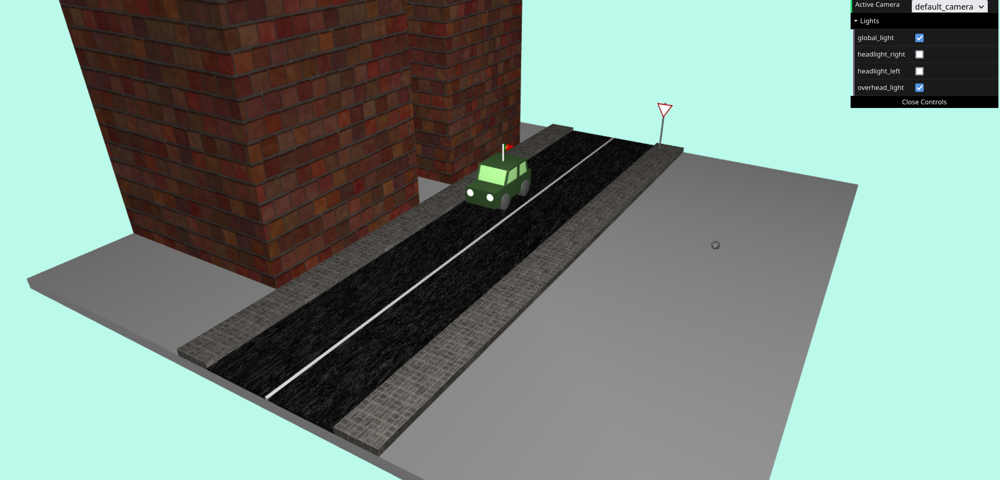
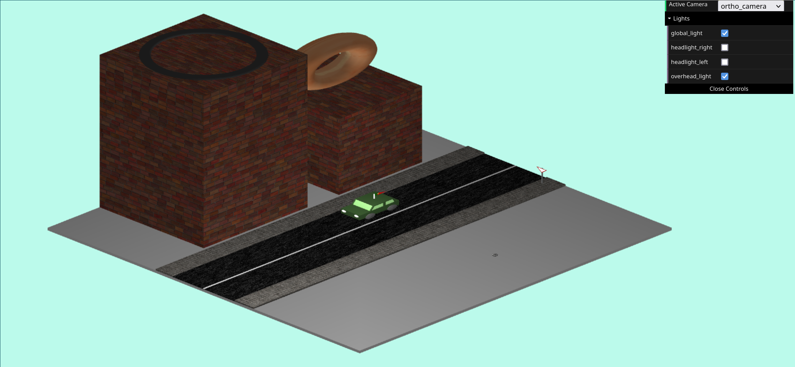
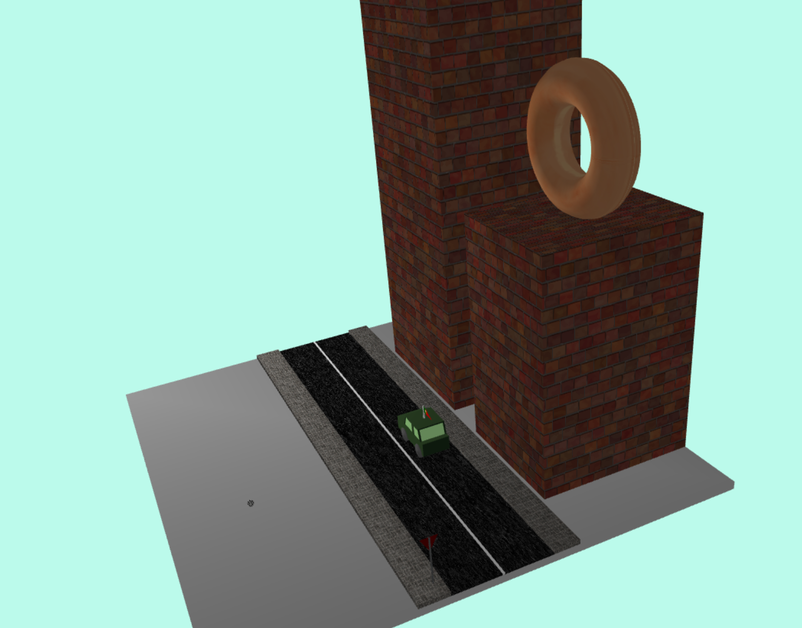
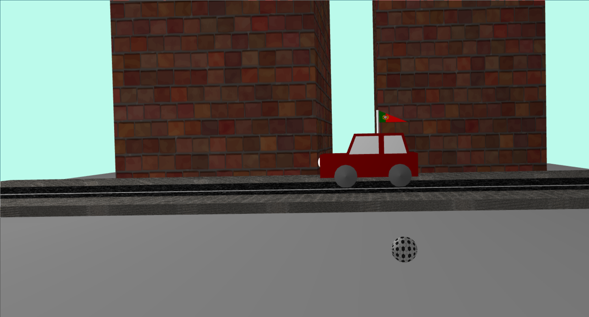
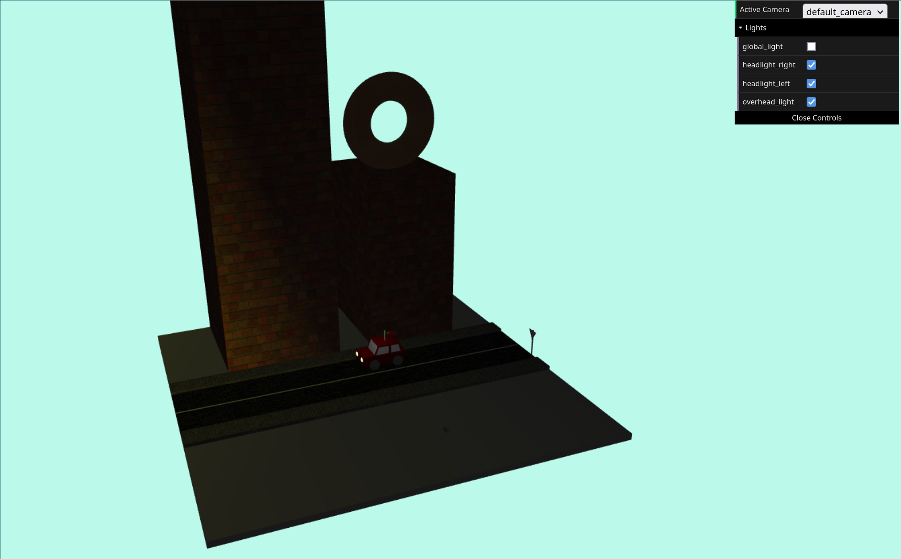

# SGI 2022/2023 - TP1

## Group T04G05
| Name                          | Number    | E-Mail                   |
| ----------------------------- | --------- | ------------------------ |
| Filipe Pinto Campos           | 201905609 | up201905609@edu.fe.up.pt |
| Francisco Gonçalves Cerqueira | 201905337 | up201905337@edu.fe.up.pt |

----

## Project information

- We developed a software architecture that clearly separates the data from the logic. Our MySceneGraph acts as the parser and generates an SceneData object containing multiple models. This scene data is afterwards used by the renderer to draw the scene.
- This class oriented parser structure allows for a clear separation of concerns and makes it easy to add new features to the parser or reuse existing ones.
- Parser contains many fault tolerance mechanisms, to ensure that the application doesn't crash due to a malformed input file. Missing attributes, materials or transformations, etc... are handled gracefully by using default values.
- Cyclic graphs are handled by removing edges that cause cycles and emitting an error.
- Our file structure allows for contextualized and helpful warning messages.
- [Scene](scenes/scene.xml)
  - Our scene shows a small city street model, containing two buildings, a car on a road surrounded by two walkways. 
  - We include two cameras, one perspective and one orthographic camera alongside four different light sources.
  - (relative link to the scene)

----
## Issues/Problems

- The LightsParser class simply acts as an wrapper to the light parsing function provided in the base code. This decision leads to a parser class with a different structure than the others, which is not ideal, but it was the most reasonable solution to integrate the provided base code with our architecture.
