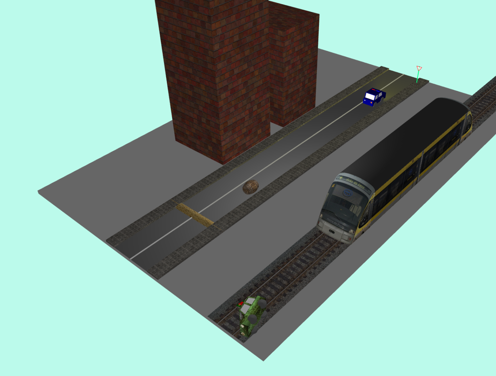
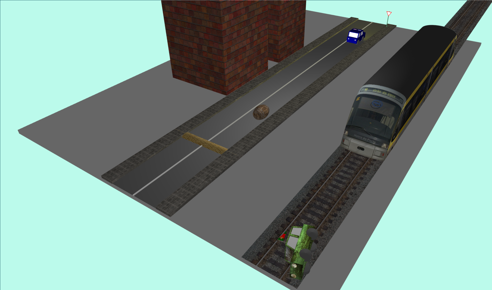
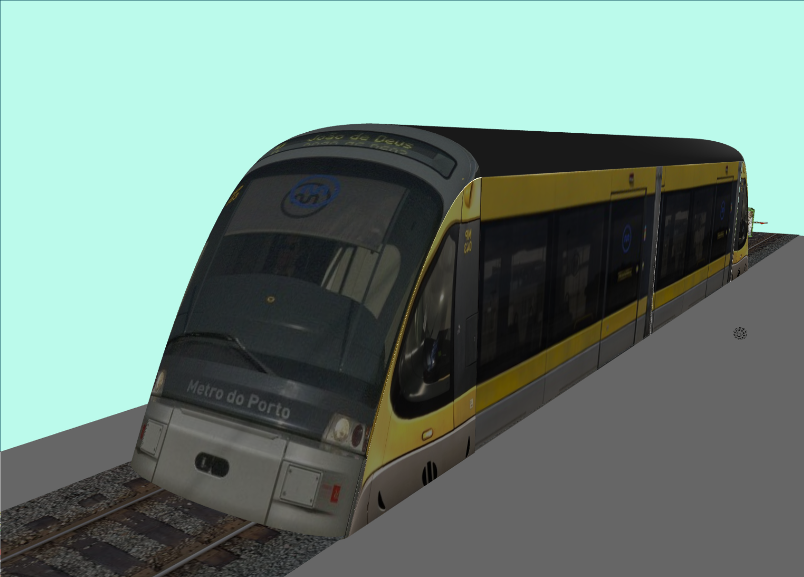
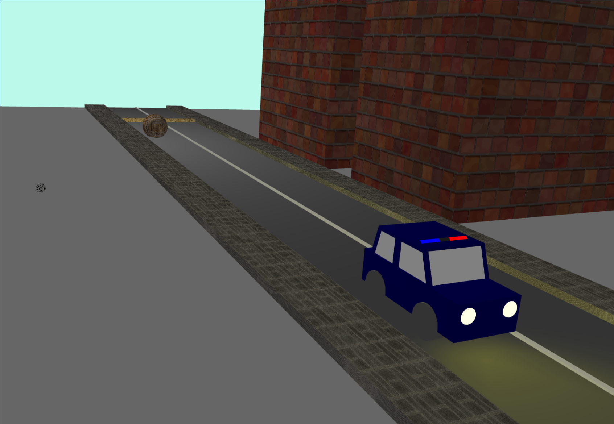
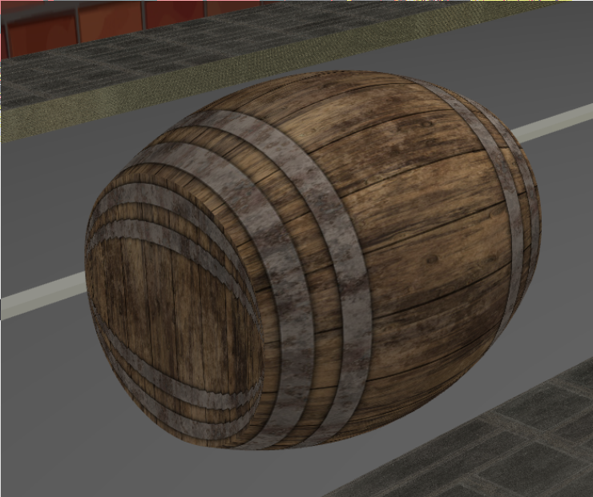
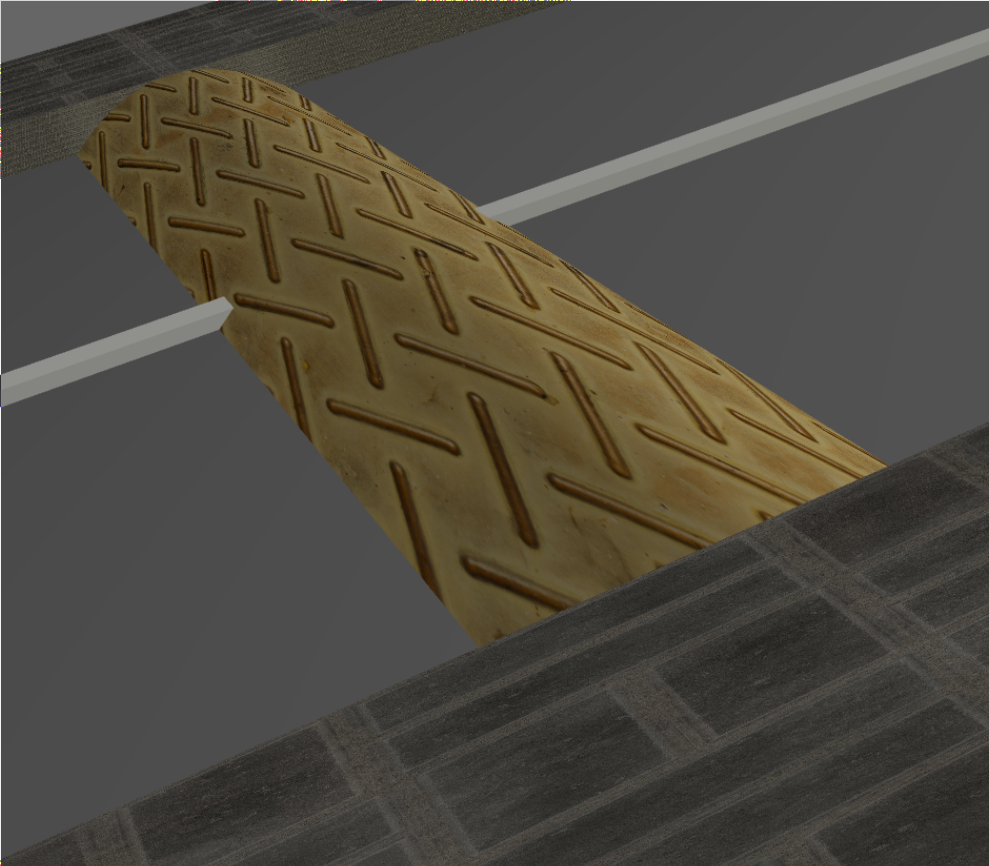

# SGI 2022/2023 - TP2

## Group T04G05
| Name                          | Number    | E-Mail                   |
| ----------------------------- | --------- | ------------------------ |
| Filipe Pinto Campos           | 201905609 | up201905609@edu.fe.up.pt |
| Francisco Gonçalves Cerqueira | 201905337 | up201905337@edu.fe.up.pt |

----


## Project information

- Our highlight shaders calculates the lighting like the defaultShader and uses it to determine the initial color of an object. By using an uniform boolean to tell the shader whether or not an texture is active, we added support for both scenarios. When an texture is active, the final color is still just the "target" color, instead of mixing it with the texture, because this seemed more aligned with the required feature.
- Our implementation features an very optimized shader rendering mechanism. We split the drawing of highlighted and non-highlighted elements in order to use less `setActiveShader` calls. While visiting the non-highlighted elements we annotate all nodes with information about whether or not they are parents of an highlighted node. This annotation allows us to skip many graph edges that won't lead to highlighted nodes during the "highlightMode" rendering therefore improving performance. We also discovered a cleaver trick that allowed us to reduce the number of setActiveShader calls to 1 per `display()` call, by inverting the render order on each call, i.e:
```
display() // 1
  - Draw normal primitives
  - setActiveShader(highlightShader)
  - Draw highlighted primitives

display() // 2
  - Draw highlighted primitives // Reusing previous set
  - setActiveShader(defaultShader)
  - Draw normal primitives

repeat
```
- [Scene](scenes/scene.xml)
  - NURBS were used to create the following objects: barrel, road bump (tent), the road floor (subdivided rectangle, which can be seen due to the lights pointed to it) and a metro.
  - The animation shows a barrel moving onto the road and a car moving to avoid it, causing it to go onto a railway on which a metro is moving. A small sphere is used to represent an explosion.
  - We used highlighted components in the police car (two on the sirens, one has a turn signal) and also one on the road sign post (to demonstrate the highlight with an texture).








----
## Issues/Problems

- No known issues
