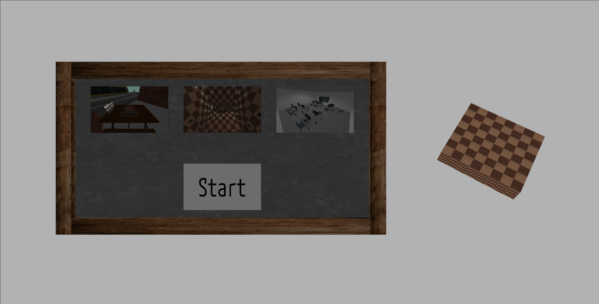
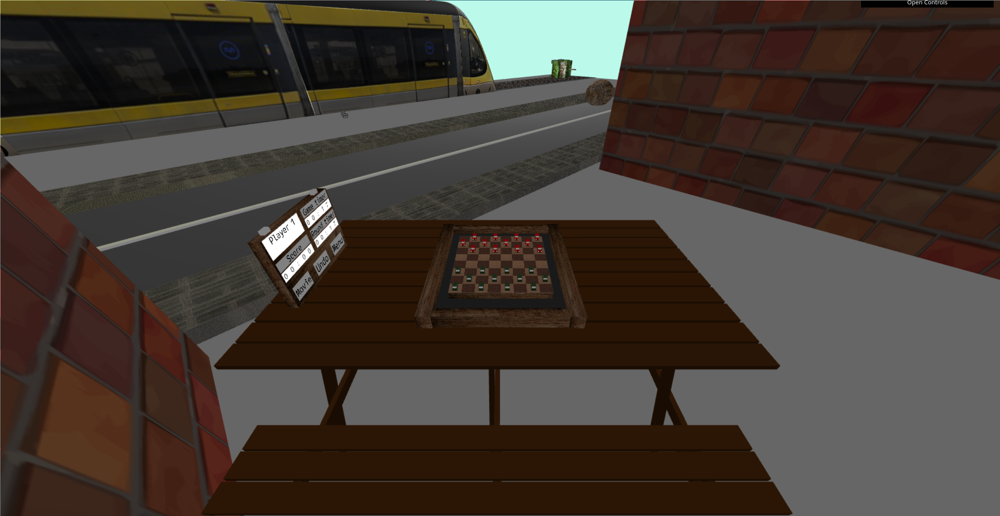
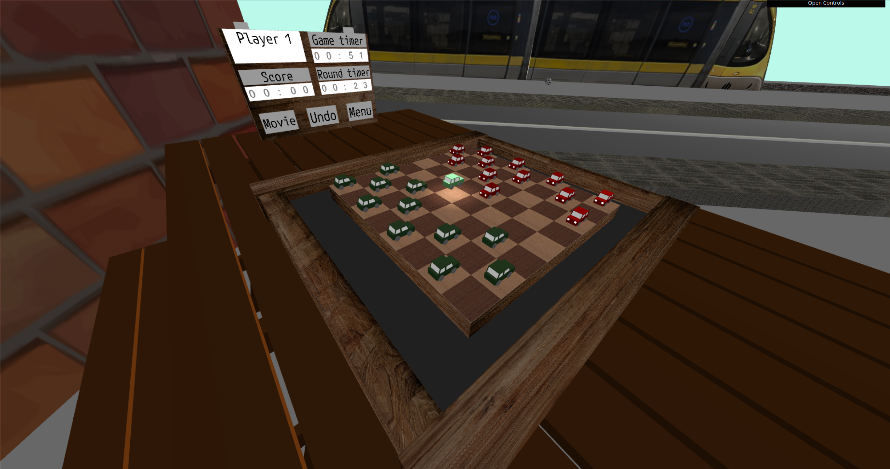
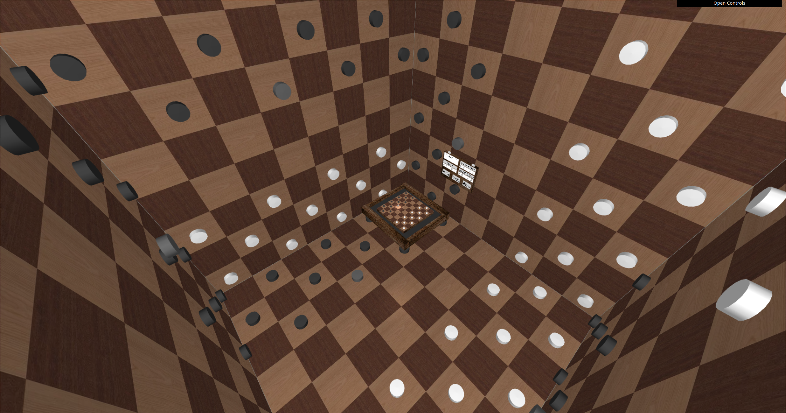
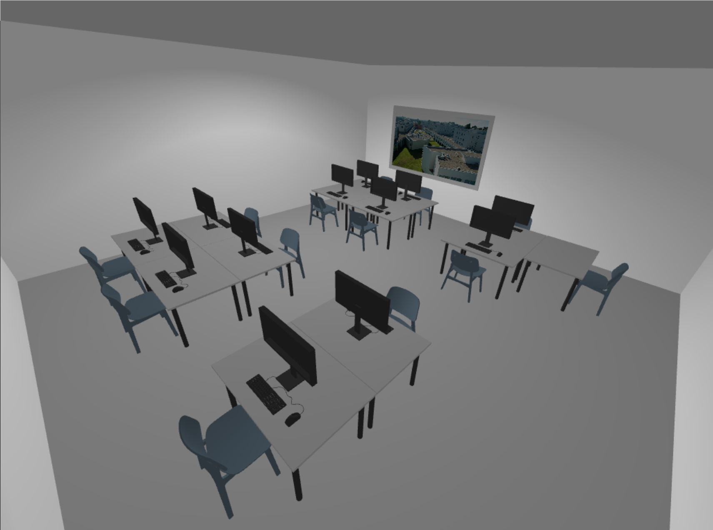
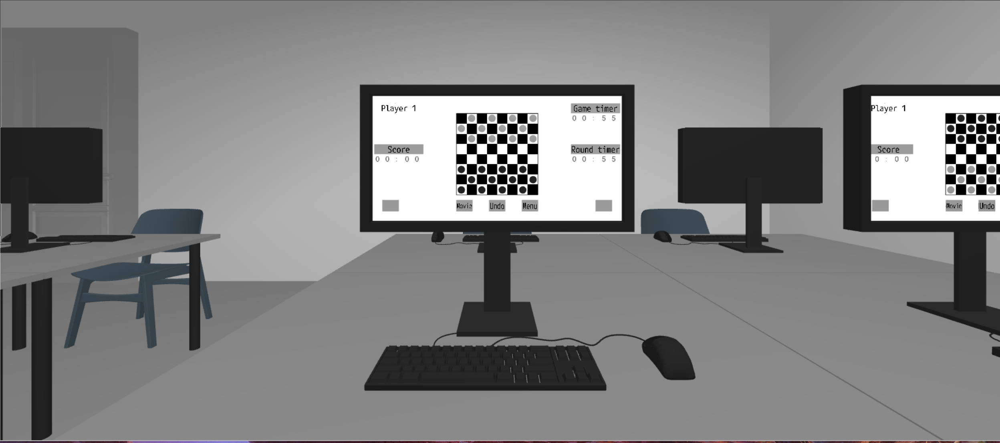

# SGI 2022/2023 - TP3

## Group T04G05
| Name                          | Number    | E-Mail                   |
| ----------------------------- | --------- | ------------------------ |
| Filipe Pinto Campos           | 201905609 | up201905609@edu.fe.up.pt |
| Francisco Gonçalves Cerqueira | 201905337 | up201905337@edu.fe.up.pt |

----

## Project information

- All our game components are completly customizable and reusable, this allows for more interesting and unique scenes. All the following components are customizable in each of the scenes: board, piece (normal/selected/king), all pickable buttons, timers and score.
- Our SXS parser now supports an `<obj>` primitive, which loads an obj file.
- To reduce the number of shader activations, which are very inefficient (due to the library used), we implemented spritesheets based on texCoords instead of using a shader for the purpose.
- Our project is structured based on the State Pattern.
- All features were implemented (i.e Movie, Undo, Score, Time tracking, Camera animation, Spotlight that follows piece animation, warning messages)
- Scenes
  - [Street](scenes/street.xml) - This scene takes place in an urban street, with two buildings, a road, a police car and a car crash animation with the metro. The checkers game occurs on a wooden table that was placed near the buildings.
  - [Board](scenes/board.xml) - The second scene is a surrealist scene where the user is surrounded by six game boards that mimic the original board, which is placed at the center.
  - [Classroom](scenes/classroom.xml) - The third scene is a realistic representation of a FEUP classroom, which contains two computers where the game can be played.

----
## Issues/Problems

- All the features are fully functioning and there are no known problems.
